# EXPLORATORY DATA ANALYSIS(EDA) ON PROSTRATE CANCER

## Gleason-based-Prostate-Cancer-Assessment

**Author**: SHAILESH DHAMA

### LIBRARIES USED :
    1.Pandas 
    2.Numpy 
    3.Rasterio 
    4.Matplotlib 
    5.Seaborn

## STEPS:

    - Data Cleaning and Data Preprocessing
    - Image Masking
    - Data Exploration
    - Data Analysis

## RESULTS:

#### Image Masking:
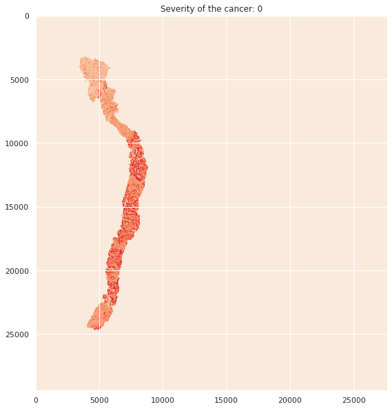
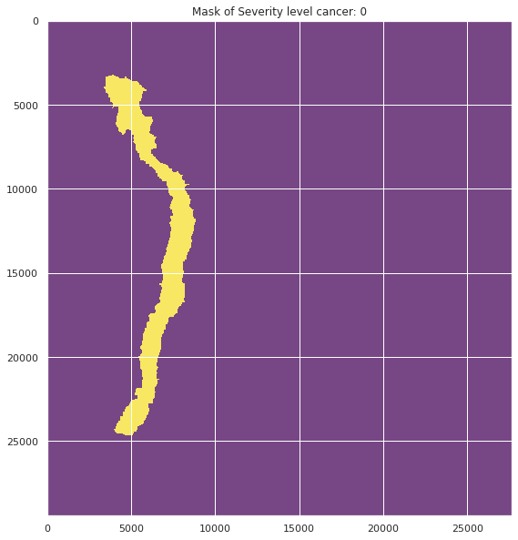

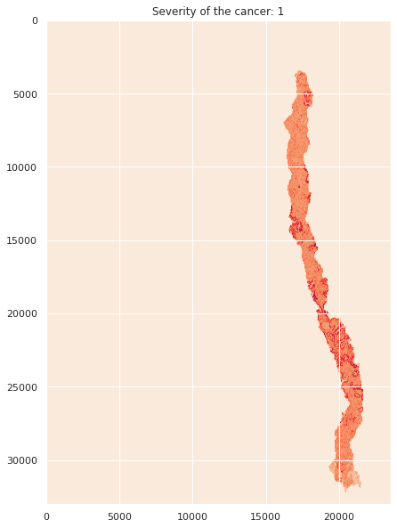
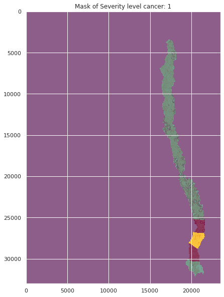

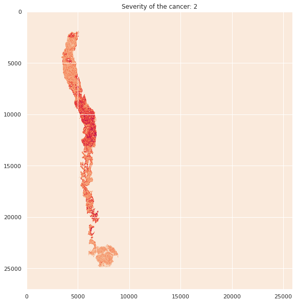
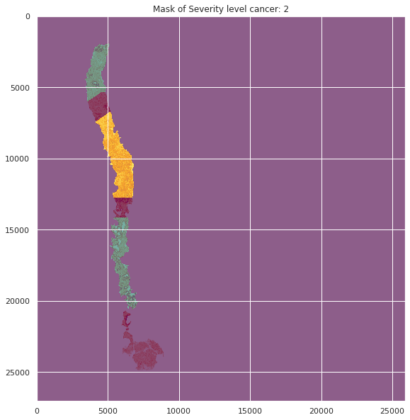

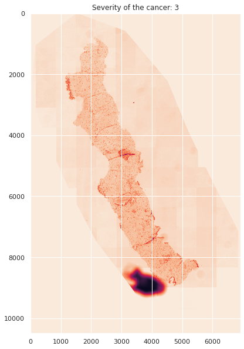
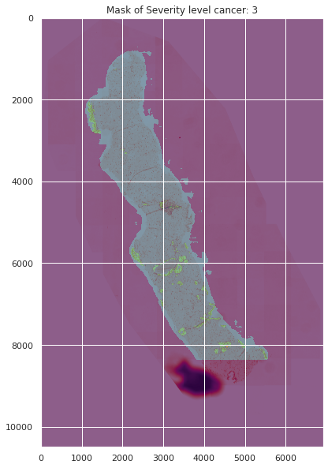

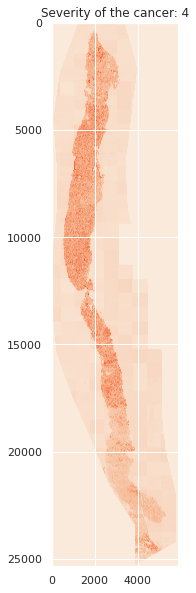
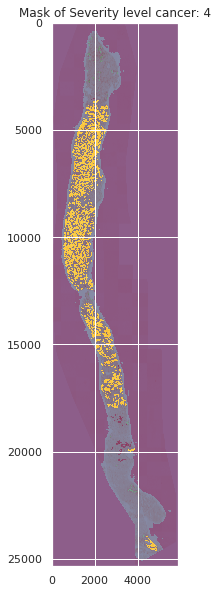

#### Data Analysis Visualisations:

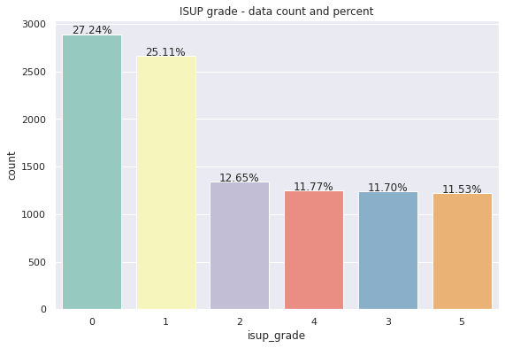
> Graph of ISUP_Grade and Data_Count in Percentage 

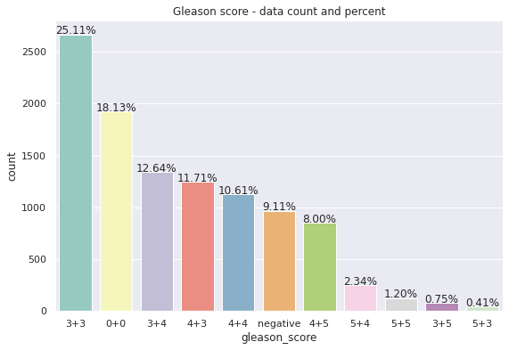
> Graph of Gleason_Score and Data_Count in Percentage

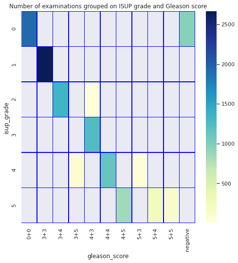
> Examination Grouping based on ISUP_Grade and Gleason_Score

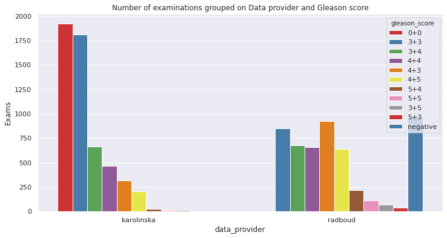
> Examination Grouping based on Data_Provider and Gleason_Score

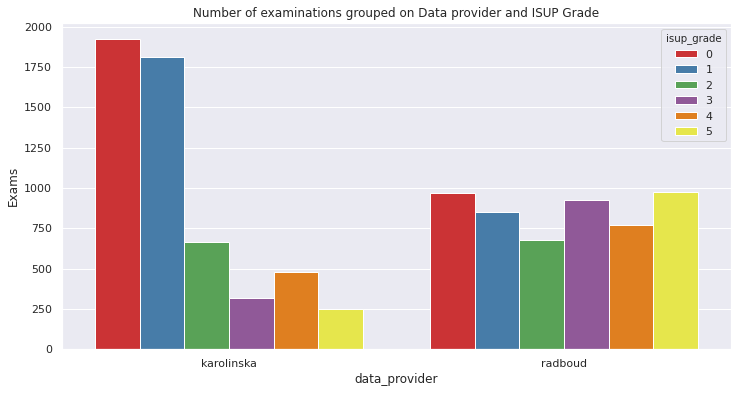
> Examination Grouping based on Data_Provider and ISUP_Grade

### For further information
Please review the narrative of our analysis in [our jupyter notebook](./prostrate-cancer-beginner-eda.ipynb)

For any additional questions, please contact **shaileshshettyd@gmail.com)


##### Repository Structure:

```

├── README.md                                       <- The top-level README for reviewers of this project.
├── prostrate-cancer-beginner-eda.ipynb             <- narrative documentation of analysis in jupyter notebook
└── images                                          <- both sourced externally and generated from code
```
